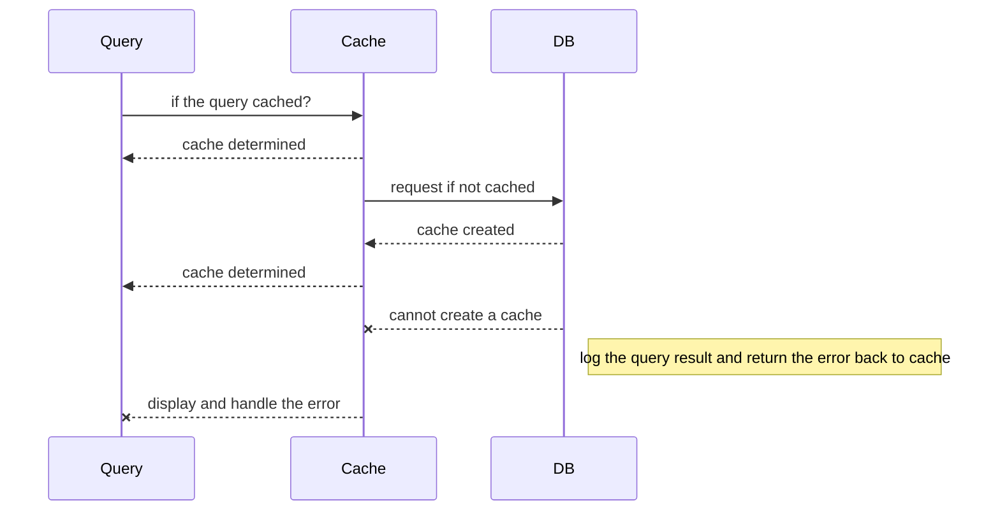
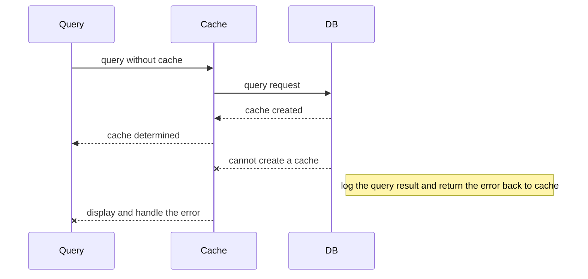

# spring-Api
A Spring Boot restful API designed for users to download the query result as a CSV file based on a lite caching mechanisms.

## Synopsis

This API allows users to query cab trip records by given a pickup date. It's designed for heavy load by implementing a lite caching mechanism with a switch to download either the fresh data or cached one.

## Prerequisition 

The API is developed by java, perl, bourne shell, SQL and tested by Linux. 

* java 8.1.8.0_161
* gradle 4.6
* mysql 5.1.73
* perl v5.10.1
* bourne shell
* Linux Centos 6.9

## Deployment

1. copy and paste the commands in install/init.sh to the terminal to automation deploy the codes 
2. download yaml script: 
    * $ wget https://raw.githubusercontent.com/joechiu/spring-api/master/install/init.yml
3. run ansible playbook:
    * $ ansible-playbook -vvv init.yml

## Test
- ApplicationTests.java for spring boot mvc, no test cases.
- test harness scripts for perl in scripts/t/. run perl db.t to see the test result for example.

## Endpoints

 - URL: http://eland.nz:8080/

|Endpoint        |Params                         |Method                       |
|----------------|-------------------------------|-----------------------------|
|/query          |pickdate (mandatory)           |GET                          |    
|                |nocache (optional, default: true)|GET                        |
|/cache          |clean (mandatory)              |GET/POST |  
|                |day (optional, default: 30)    |GET/POST                |

## CLI

1. list CSV records by query pickup date with cache mode:
    * curl "http://eland.nz:8080/query?pickdate=2013-12-26"
2. list CSV records by query pickup date without cache mode:
    * curl "http://eland.nz:8080/query?pickdate=2013-12-26&nocache=1"

3. clean all caches
    * curl -H "Auth: ThisIsNotAnAuth" -X POST "http://eland.nz:8080/cache?clean=1"
4. clean the caches older than 15 days
    * curl -H "Auth: ThisIsNotAnAuth" -X POST "http://eland.nz:8080/cache?clean=1&day=15"

## ISSUES
* Whitelabel Error Page showing on the page if meet a severlet error

## UML
* query request with cache mode
    - snapshot 

    - mermaid markdown UML

* fresh query without cache mode
    - snapshot 

    - mermaid markdown UML

## References
- Google http://google.com
- SPRING INITIALIZR https://start.spring.io/
- Stack Overflow https://stackoverflow.com/
- Maven Repository https://mvnrepository.com
- Mermaid Online Editor https://stackedit.io

## License

See the attached license.
